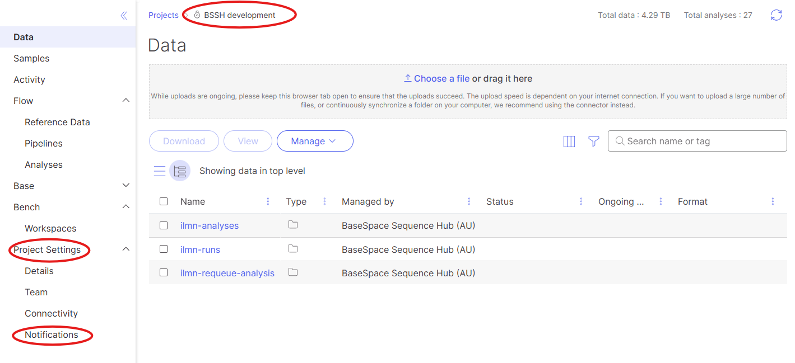
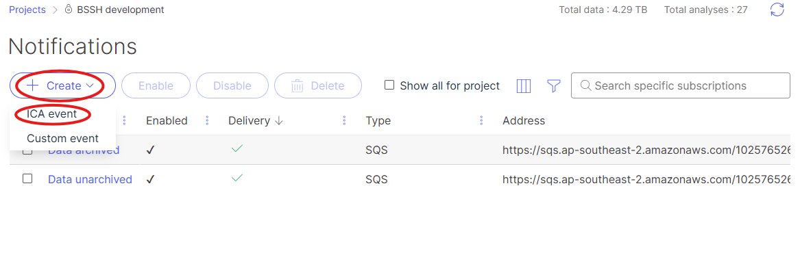
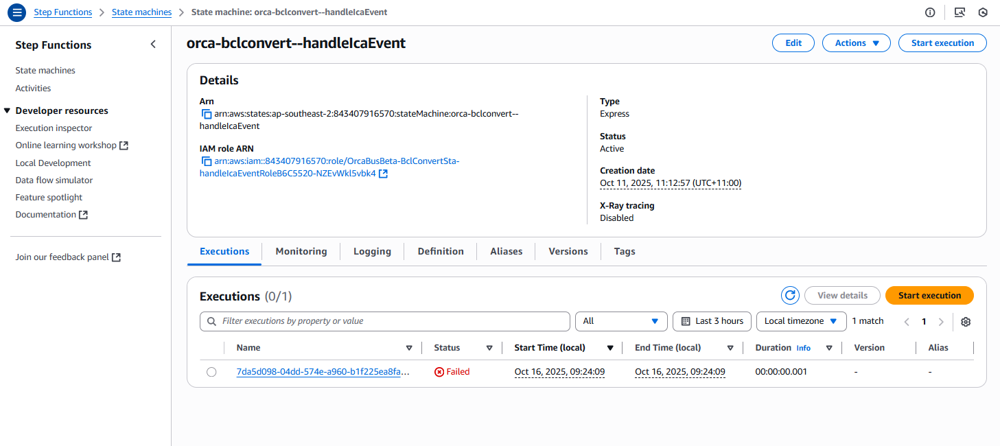

# Add SQS Queue to Notifications Channel

- Version: 1.0
- Contact: Alexis Lucattini, [alexisl@unimelb.edu.au](mailto:alexisl@unimelb.edu.au)

## Overview

This document outlines the steps to add an Amazon SQS (Simple Queue Service) queue to an ICAv2 Project.
The SQS target may be a executor such as a lambda or step function, or a relayer such as an Event Bus.

In the case of the BCLConvert Manager, we directly forward the SQS target to the Step Function for handling.

This document also assumes the user has admin access of the ICA domain.

The UMCCR domain is a private domain, and can be logged into at [https://umccr-prod.login.illumina.com/](https://umccr-prod.login.illumina.com/).

## Finding the BSSH Project

The BSSH Project will be 'greyed' out as these are BaseSpace Managed ICA Projects.
However since we are monitoring ICA events, we access the Project via the ICAv2 console.

For Development, we use the 'BSSH development' domain.
For Staging, we use the 'BSSH staging' domain.
For Production, we use the 'BSSH icav2-sequencing' domain.

## Adding the SQS Queue to the Notifications Channel

Head in to the project and select the "Notifications" tab under "Project Settings".

Under notifications, click 'Create' and 'ICA Event'

In the Create Notification dialog, select the following options:

- Event: Analysis status changed
- Type: SQS
- Address: https://sqs.<region>.amazonaws.com/<account-id>/<queue-name>

Where queue-name will be the name of the ICA SQS Queue in the [infrastructure constants file](../../../../infrastructure/stage/constants.ts)

You may wish to select the 'Send Test Message' to confirm that the SQS queue is receiving messages.

On your Step Function console, you should see the message arrive

